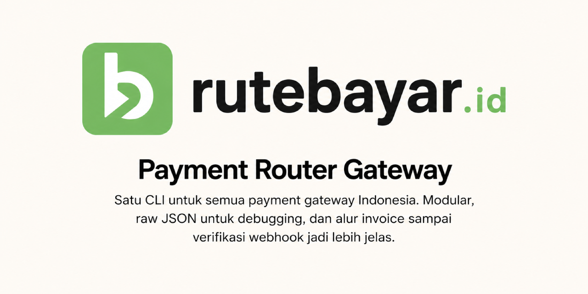

# Rute Bayar



[](https://github.com/pendig/rute-bayar/actions/workflows/ci.yml)
[](https://github.com/pendig/rute-bayar/actions/workflows/release.yml)
[](https://github.com/pendig/rute-bayar/releases)
[](./LICENSE)
[](https://pkg.go.dev/github.com/pendig/rute-bayar)

Rute Bayar is an open source payment router for Indonesian payment gateways.

The project provides one internal interface for multiple providers, starting with **Xendit**, **Midtrans**, and **DOKU Checkout**. It is designed as a Go CLI and daemon that can create payments, receive provider webhooks, store raw JSON traffic for debugging, and optionally forward incoming webhooks to user-configured targets.

> Status: stable `v0.1.6`. The repository includes webhook signature verification for Midtrans and DOKU, callback-token verification for Xendit, plus `pay create`, `pay status`, `reconcile`, and SQLite persistence. Midtrans/Xendit refund flows are implemented; DOKU refund is intentionally disabled until Refund API/disbursement setup is wired. Real sandbox proof covers Midtrans/Xendit webhook callbacks, Xendit refund reconciliation through final `refund.succeeded` callback, and DOKU sandbox checkout/status plus signed webhook forwarding simulation. Webhook forwarding target management is also available via CLI.

Latest release: [v0.1.6](https://github.com/pendig/rute-bayar/releases/tag/v0.1.6)

## Features

- Modular provider adapters.
- CLI-first onboarding and operations.
- Webhook daemon per provider.
- Pass-through webhook forwarding.
- Raw inbound and outbound JSON storage for debugging and audit.
- SQLite-first local storage.
- Initial support target: Xendit Payment Sessions, Midtrans, and DOKU Checkout.

## AI Agent Skill

Rute Bayar also ships an AI Agent skill for agent runners and coding assistants that need a clear workflow for sandbox/prod setup, invoice creation, payment status checks, webhook forwarding, provider contribution, and release readiness.

Install the skill with skills.sh:

```bash
npx skills add pendig/rutebayar-agent-contributor
```

Skill page: [skills.sh/pendig/rutebayar-agent-contributor](https://www.skills.sh/pendig/rutebayar-agent-contributor)

Example prompts:

```text
Use $rutebayar-agent-contributor to set up Rute Bayar sandbox webhook testing with Xendit forwarding.
```

```text
Use $rutebayar-agent-contributor to add a new payment provider adapter and prepare the PR checklist.
```

## Quick Start

Clone the repository:

```bash
git clone git@github.com:pendig/rute-bayar.git
cd rute-bayar
```

Install Go 1.22 or newer, then check the CLI:

```bash
go build -o bin/rutebayar ./cmd/rute-bayar
./bin/rutebayar version
./bin/rutebayar provider list
```

Onboard Xendit credentials into local SQLite:

```bash
./bin/rutebayar onboard xendit --secret-key "$XENDIT_SECRET_KEY" --environment sandbox
./bin/rutebayar provider accounts
```

Onboard Midtrans credentials into local SQLite:

```bash
./bin/rutebayar onboard midtrans --merchant-id "$MIDTRANS_MERCHANT_ID" --client-key "$MIDTRANS_CLIENT_KEY" --server-key "$MIDTRANS_SERVER_KEY" --environment sandbox
./bin/rutebayar provider test midtrans
```

Onboard DOKU Checkout credentials into local SQLite:

```bash
./bin/rutebayar onboard doku --client-id "$DOKU_CLIENT_ID" --secret-key "$DOKU_SECRET_KEY" --environment sandbox
./bin/rutebayar provider test doku
```

Note: DOKU callback delivery still depends on the matching Notification URL being configured in DOKU Back Office per channel, so keep the path aligned with `/webhooks/doku` before relying on live webhook callbacks.

Start the webhook daemon:

```bash
./bin/rutebayar webhook serve --addr :8080 --environment sandbox
```

Check the daemon:

```bash
curl http://localhost:8080/healthz
```

### Local Webhook + Health Check

Run daemon and verify:

```bash
./bin/rutebayar webhook serve --addr :8080 --environment sandbox
curl -i http://localhost:8080/healthz
```

Expected:

```json
{"status":"ok"}
```

Send a local webhook simulation:

```bash
curl -X POST http://localhost:8080/webhooks/xendit \
  -H 'Content-Type: application/json' \
  -d '{"event":"payment_session.created","status":"ACTIVE"}'
```

### Cloudflare Tunnel Test (temporary)

If you need a public URL for provider callback testing:

```bash
wrangler tunnel quick-start http://localhost:8080
```

After Cloudflare prints a public URL (for example `https://xxxx.trycloudflare.com`), verify:

```bash
curl -i https://xxxx.trycloudflare.com/healthz
```

Set provider webhook URL to:

```text
https://xxxx.trycloudflare.com/webhooks/xendit
https://xxxx.trycloudflare.com/webhooks/midtrans
https://xxxx.trycloudflare.com/webhooks/doku
```

The daemon verifies webhook signatures when provider credentials/configuration support it:
- Midtrans: `signature_key` is validated with `order_id + status_code + gross_amount + server_key`.
- Xendit: callback token validation uses `X-Callback-Token` when configured on onboarding.
- DOKU: `Signature` is validated with DOKU's HMAC-SHA256 header format using the webhook target path, request timestamp, request ID, body digest, client ID, and secret key.

Note: if the provider credentials/configuration are not present, webhook verification is skipped and requests are stored as raw inbound payloads for debugging.

## Installation

### Fast install

Use one command to detect OS and install latest stable binary:

```bash
curl -fsSL https://raw.githubusercontent.com/pendig/rute-bayar/main/scripts/install.sh | bash
```

Optional flags:

```bash
# install to local user bin only
curl -fsSL https://raw.githubusercontent.com/pendig/rute-bayar/main/scripts/install.sh | bash -s -- --local

# pin version
curl -fsSL https://raw.githubusercontent.com/pendig/rute-bayar/main/scripts/install.sh | bash -s -- --version v0.1.4
```

### Make sure command is in your shell PATH

If installation succeeds but `rutebayar` command is not found, ensure your binary folder is on PATH.

Homebrew paths are usually:

- Apple Silicon macOS: `/opt/homebrew/bin`
- Intel macOS: `/usr/local/bin`
- Linuxbrew: `~/.linuxbrew/bin` or `/home/linuxbrew/.linuxbrew/bin`

```bash
if command -v brew >/dev/null 2>&1; then
  eval "$(brew shellenv)"
fi
which rutebayar
```

If you used binary download and placed it in a local folder, run from that folder with `./rutebayar`, or move it to a PATH folder:

```bash
chmod +x ./rutebayar
mkdir -p ~/.local/bin
mv ./rutebayar ~/.local/bin/rutebayar
export PATH="$HOME/.local/bin:$PATH"
```
To persist PATH for future shells, add to your shell profile:

```bash
# For zsh
echo 'export PATH="$HOME/.local/bin:$PATH"' >> ~/.zshrc

# For bash
echo 'export PATH="$HOME/.local/bin:$PATH"' >> ~/.bashrc
```

Install with Homebrew:

```bash
brew tap pendig/tap
brew install rutebayar
rutebayar version
```

Build a local binary:

```bash
go build -o bin/rutebayar ./cmd/rute-bayar
```

Run it:

```bash
./bin/rutebayar version
```

Install into your Go binary path:

```bash
go install github.com/pendig/rute-bayar/cmd/rute-bayar@latest
mv $(go env GOPATH)/bin/rute-bayar $(go env GOPATH)/bin/rutebayar
```

For stable builds, prefer the latest tagged release or a local build from `main`.


## Usage

Available command skeleton:

```bash
rutebayar onboard
rutebayar onboard xendit --secret-key <key> --environment sandbox
rutebayar onboard midtrans --merchant-id <id> --client-key <key> --server-key <key> --environment sandbox
rutebayar onboard doku --client-id <id> --secret-key <key> --environment sandbox
rutebayar provider list
rutebayar provider accounts
rutebayar provider test midtrans
rutebayar provider test xendit
rutebayar provider test doku
rutebayar pay create --provider xendit --method payment_link --reference rb-xnd-001 --amount 15000
rutebayar pay create --provider midtrans --method bank_transfer --bank bca --reference rb-0001 --amount 15000
rutebayar pay create --provider midtrans --method qris --bank gopay --reference rb-qris-001 --amount 15000 --notification-url https://<public-domain>/webhooks/midtrans
rutebayar pay create --provider doku --method checkout --reference rb-doku-001 --amount 15000 --notification-url https://<public-domain>/webhooks/doku
rutebayar pay status --provider midtrans --reference rb-0001
rutebayar pay refund
rutebayar webhook serve --addr :8080
rutebayar webhook forward list
rutebayar webhook forward add
rutebayar webhook forward update
rutebayar webhook forward remove
rutebayar webhook replay --event-id <id> [--provider midtrans|xendit|doku]
rutebayar webhook forward attempts list --status failed
rutebayar webhook forward attempts show <attempt-id>
rutebayar webhook forward attempts retry <attempt-id>
rutebayar db migrate
rutebayar reconcile
rutebayar version
```

These commands establish the current user experience for alpha internal usage.

## Configuration

Copy the example environment file:

```bash
cp .env.example .env
```

Default local configuration:

```env
RUTE_BAYAR_ENV=sandbox
RUTE_BAYAR_DB_PATH=./rute-bayar.sqlite3
RUTE_BAYAR_WEBHOOK_ADDR=:8080
```

Do not commit `.env` or provider credentials. The file is ignored by Git.

### Troubleshooting

- `bind: operation not permitted` when starting daemon: environment may block local socket binding; try another port or run in a normal local terminal.
- `502` from `trycloudflare.com`: confirm the local daemon is running and still reachable at the forwarded local URL.
- DNS resolve failure for `*.trycloudflare.com`: usually environment/network-restricted; retry in another network/tool environment.

## Development

Run formatting and tests:

```bash
gofmt -w ./cmd ./internal
go test ./...
./scripts/smoke-local.sh
```

Validate the SQLite migration:

```bash
sqlite3 :memory: ".read migrations/0001_initial.sql"
```

Project layout:

- `cmd/rute-bayar`: CLI entrypoint.
- `internal/cli`: command routing.
- `internal/daemon`: HTTP daemon for webhook receiving.
- `internal/domain`: provider-neutral domain types.
- `internal/provider`: provider adapter contracts and registry.
- `internal/forwarding`: pass-through webhook forwarding service.
- `internal/storage`: storage implementations.
- `migrations`: SQLite schema migrations.
- `docs`: product and technical documentation.

Useful docs:

- [Production Deployment](./docs/production-deployment.md)
- [Operations Runbook](./docs/operations-runbook.md)
- [Release Readiness](./docs/release-readiness.md)

Run the initial migration through the CLI:

```bash
rutebayar db migrate
```

## Provider Notes

Xendit sandbox simulation has been tested with Payment Sessions and refund callbacks:

- `POST /sessions` creates a Payment Session.
- `GET /sessions/{session_id}` retrieves status.
- `POST /refunds` creates an async refund request.
- Initial Xendit `ACTIVE` status maps naturally to Rute Bayar `pending`.
- Final Xendit `refund.succeeded` callbacks reconcile stored refunds and update the local payment intent to `refunded`.
- `items[].category` is required for the tested Payment Session payload.

See [docs/xendit-sandbox-simulation.md](./docs/xendit-sandbox-simulation.md) and [docs/release/issue-40-xendit-refund-e2e-proof.md](./docs/release/issue-40-xendit-refund-e2e-proof.md).

## Design Principles

- Modular per provider.
- Keep provider-specific behavior inside adapter packages.
- Store inbound and outbound payloads as raw JSON.
- Keep webhook forwarding pass-through by default.
- Make CLI onboarding simple before asking users to configure providers manually.
- Start with SQLite, but keep the domain portable.

## Documentation

Read the project docs:

- [Product Requirements](./docs/prd.md)
- [Architecture](./docs/architecture.md)
- [Model Data](./docs/data-model.md)
- [CLI Onboarding](./docs/cli-onboarding.md)
- [Provider Integration](./docs/provider-integration.md)
- [Implementation Status](./docs/implementation-status.md)
- [Webhook Forwarding](./docs/webhook-forwarding.md)
- [Status Mapping](./docs/status-mapping.md)
- [Operations Runbook](./docs/operations-runbook.md)
- [End-to-End Smoke Test](./docs/end-to-end-smoke.md)
- [Development](./docs/development.md)
- [Changelog](./CHANGELOG.md)
- [Xendit Sandbox Simulation](./docs/xendit-sandbox-simulation.md)
- [Midtrans Sandbox Simulation](./docs/midtrans-sandbox-simulation.md)
- [Release Readiness](./docs/release-readiness.md)

## Community

- [Contributing](./CONTRIBUTING.md)
- [Code of Conduct](./CODE_OF_CONDUCT.md)
- [Security Policy](./SECURITY.md)
- [Support](./SUPPORT.md)
- [Issues](https://github.com/pendig/rute-bayar/issues)
- [Releases](https://github.com/pendig/rute-bayar/releases)

## License

Rute Bayar is released under the [MIT License](./LICENSE).

Copyright (c) 2026 Wahyu Adi Putra Pena Digital.

## Roadmap

- Stabilize Midtrans refund E2E when sandbox payable balance is available.
- Complete final stable readiness pass for `v0.1.0` before publishing a non-alpha release.
- Add more Midtrans payment methods and provider-specific diagnostics.
- Improve operational observability for webhook forwarding and replay.
- Expand DOKU beyond Checkout into refund/disbursement flows after credential requirements are confirmed.
